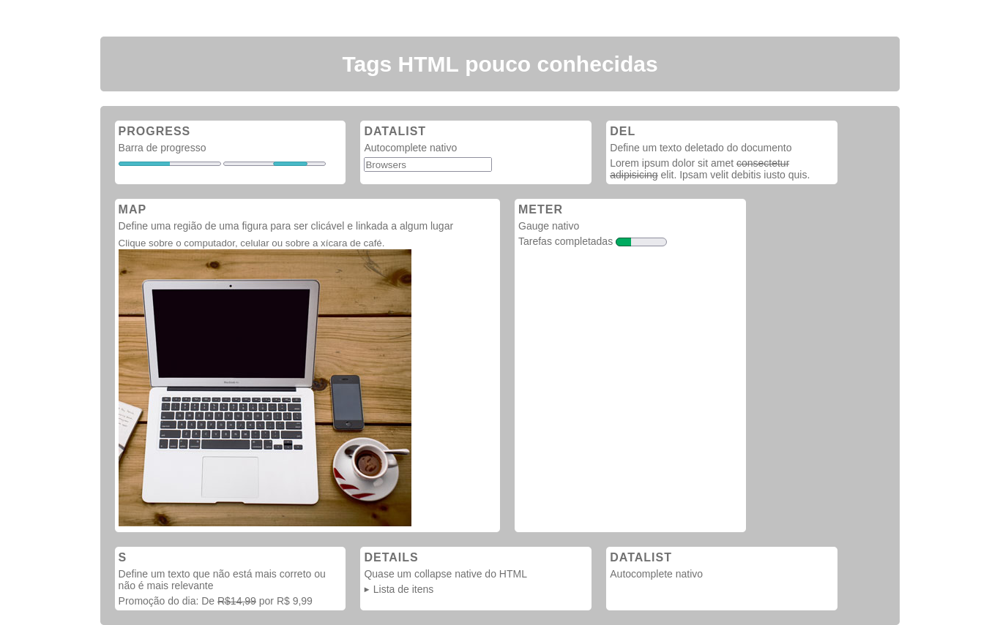

<h1 align="center">Tags HTML pouco usadas</h1>
<h2 align="center">Listando algumas tags poucos usadas</h2>
 

De <i>gauges</i> a <i>collapses</i> nativos com HTML.

Confira uma lista de tags HTML que são pouco usadas e até mesmo desconhecidas por muitos.

  

Tem uma porrada da outras tags também não tão usadas. Aqui listei mais algumas mas a lista completa pode ser vista no <a href="https://www.w3schools.com/tags/default.asp" target="_blank">W3 Schools</a>.

<ul>
  <li> 
    <a href="https://www.w3schools.com/tags/tag_caption.asp" target="_blank">Caption</a> 
  </li>
  <li> 
    <a href="https://www.w3schools.com/tags/tag_dfn.asp" target="_blank">DFN</a> 
  </li>
  <li> 
    <a href="https://www.w3schools.com/tags/tag_figcaption.asp" target="_blank">Figcaption</a> 
  </li>
  <li> 
    <a href="https://www.w3schools.com/tags/tag_param.asp" target="_blank">Param</a> 
  </li>
  <li> 
    <a href="https://www.w3schools.com/tags/tag_track.asp" target="_blank">Track</a> 
  </li>
<ul>